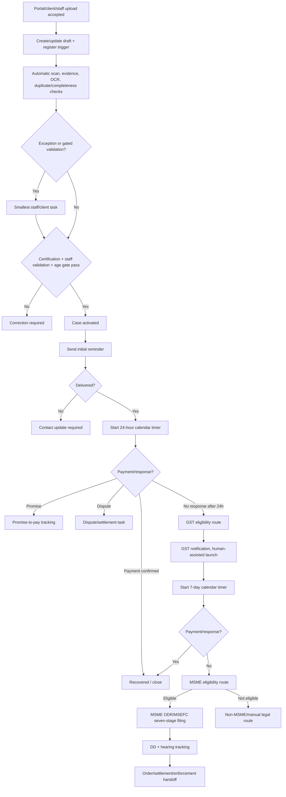

# Workflow and State Machine

## Canonical flow

## Autonomous trigger and blocker behavior

- Any authorized portal, client or staff upload immediately creates or updates a draft case and starts malware scanning, immutable evidence registration, OCR/extraction, duplicate/completeness checks and state/task projection. No staff click is required to start preparation.
- Each successful deterministic step reevaluates prerequisites and schedules the next approved step automatically. A human task is created only for low-confidence, missing or contradictory data; client certification; staff/legal judgment; disputes, settlements or payment confirmation; physical DD/hearing work; portal drift/failure; or another expressly gated action.
- Upload alone does not activate a case or waive client certification, staff/legal determination, the 60-day overdue gate or audited override, contact requirements, confirmed-payment stop, per-client/action automation mode or the global kill switch.
- Portal preparation and prefill may run automatically. A vault-authorized credential may open the controlled session, but OTP/CAPTCHA are never stored or bypassed and final human actions remain where portal/security policy requires them. Completion of the human checkpoint automatically resumes the next deterministic step.
- Every trigger, job and transition is idempotent and reconstructable. A retryable technical failure retries once; a second failure creates an urgent exception task without duplicate messaging, filing or state advancement.
- Staff and client views show when automation started, the current step or blocker, the next scheduled action and `waiting on client|staff|portal|system` ownership.

## Timing

- IST timezone.
- Messages scheduled for 11:00 AM.
- No scheduled outbound messages on Sunday; roll to next permitted window.
- 24-hour timer begins only after successful delivery of the initial reminder.
- Seven-day timer begins after the GST communication is successfully submitted/recorded; exact portal event must be confirmed.
- Internal task overdue by 24 hours escalates to admin.

## Case statuses

Received; Under validation; Correction required; Active; Initial communication sent; Contact update required; Payment confirmation required; Promise to pay; Dispute/settlement; GST eligibility review; GST notification prepared; GST notification filed; MSME eligibility review; MSME ODR filed; MSEFC/DD; Hearing scheduled; Adjourned; Recovered; Withdrawn; Closed; Automation failed; Archived.

## Rules

- Staff can pause, resume, extend, skip, restart, correct or advance a case only with a reason.
- Deterministic approved steps advance without a recurring staff start/continue action; staff interventions are explicit exceptions, overrides or gates.
- New invoices added after seven elapsed days create a new case.
- Grouped versus separate invoices is an operator choice; grouped is normal.
- Payment/settlement confirmation requires client confirmation before stopping escalation.
- Confirmed payment immediately cancels pending actions.
- Failure of both message channels pauses escalation and alerts staff/client for corrected contact details.
- Government action fails closed on changed UI, missing expected fields or missing receipt.

## DD, hearing and adjournment (P0-5)

The `Adjourned` status listed above is now reachable: a scheduled hearing
that doesn't conclude moves to `Adjourned` (`waiting_on: portal`, blocker
"Hearing adjourned — awaiting next date"), and a subsequent
`HEARING_SCHEDULED` event from `Adjourned` returns the case to `Hearing
scheduled` with the new date. Each hearing occurrence (not each case) is
its own durable record, so a reschedule preserves full history rather than
overwriting the prior date. See `docs/workflow-durability/index.md` for the
full model, including exactly which follow-up tasks get raised/resolved at
each step and the retry/idempotency guarantees.

## MSME ODR stages observed in video

Claimant/Seller Details → Respondent/Buyer Details → Advocate Details (optional) → Statement of Claim → Documents → Checklist → Preview/Submit confirmation. Each stage should support save/resume and the final submitted snapshot should be immutable.
